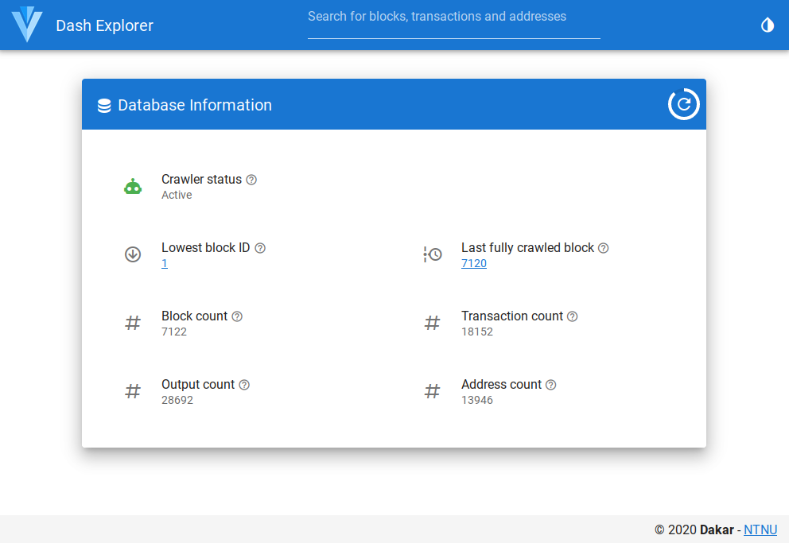
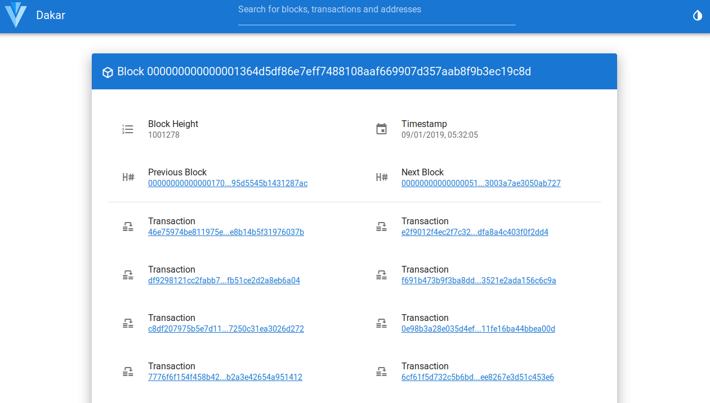

# DashRPC

## Info

This is a Dash transaction processor, written in Go.

## Dependencies

* `btcsuite` - core wire communication layer
* `Dgraph` - data storage and processed blockchain data

## Development

Guide

1. Coding must be done through feature branches
1. Work must be linked to issues from the issue tracker
1. Work should be documented 
1. Work should have unit tests associated, when appropriate  
1. New work should undergo code-review before merging  
1. Small editorial and documentation work can be done directly in `master`
1. [Propogate](https://dave.cheney.net/2015/11/05/lets-talk-about-logging) and [wrap](https://blog.golang.org/go1.13-errors) errors. 
In short: Propogate errors with additional information up to the `main` package and log them there. Do not log errors in other package than `main`. 
Only log if there is an error. Do not log metrics.

Branches
* `master` - main stable dev branch, must compile and should work.
* `production` - deployed branch, no work/commits should be done in here.
*  feature branches - main mechanism for new work.

## Start
### Setup Dash
* Setup `dashd` and let it sync. A GUI is available via `dash-qt`. Dash can be downloaded [here](https://www.dash.org/downloads/). Verify the file hashes.
* Launch the Dash daemon `dashd` with RPC user and password. In this example the default values from [crawler.go](cmd/crawler.go) are used.
```bash
dashd -rpcuser=rpc1user -rpcpassword=1234pass
```

### Setup Dgraph
* Download submodules
```bash
git submodule update --init --recursive
```
* Change to the `docker` directory and create a new external docker network
```bash
cd <project_dir>/dashrpc/docker
docker network create dgraph_default
```
* Change the whitelisted ip range in `docker-compose.yml` to your private ip (line 29)
* Execute `docker-compose up` to start Dgraph
* After the startup is complete the database explorer `Ratel` is available via `http://localhost:8000/?local`

## Setup Crawler
* Build the `crawler`
```bash
cd <project_dir>/dashrpc
go build ./cmd/crawler
```

* Launch the crawler with the following command
```bash
# -reset will delete all data on the dgraph instance and setup a new schema
./crawler -continuous -reset -startserver
```
* The REST API can be accessed via the address printed in the standard output.
Check the [crawler description](cmd/crawler/Readme.md) for more details. 
Example output:

```text
Go DashRPC client  v0.0.1
Block crawler

crawler 2020/08/11 13:15:13 dropped all data
crawler 2020/08/11 13:15:15 setup new schema
crawler 2020/08/11 13:15:15 Current block count in the chain of the RPC client: 1319430
crawler 2020/08/11 13:15:15 Starting server at endpoint http://localhost:8081
crawler 2020/08/11 13:15:15 Starting crawling at Id: 1, Hash: 000007d91d1254d60e2dd1ae580383070a4ddffa4c64c2eeb4a2f9ecc0414343
```

## Screenshots

Entry page



Block page


