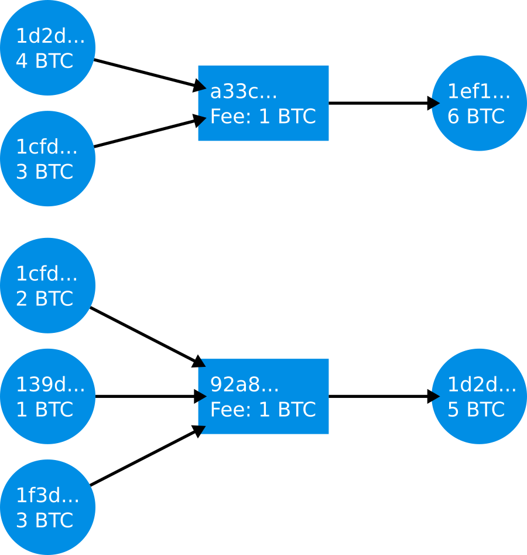

# Address Cluster

An address cluster is a set of blockchain addresses, which can be linked together by a common property.
The shared property between them is usually the possession and control by a single user.

There exist several methods, which try to detect the ownership of addresses by a single user.

## Multi-Input Clustering

Multi-input clustering, also called common-spend clustering, assumes that all inputs of a
transaction are signed by the same entity. Thus, all input addresses belong to the same entity.
Addresses of transaction outputs are not considered. By applying this method to all transactions of
a blockchain, links between transactions can be revealed.

In Dakar all transactions, which are not classified as CoinJoin transactions, are clustered via this method.

### Example

With multi-input clustering two address clusters can be built from the transactions shown below:

 - Cluster A with 2 addresses: ``1d2d...`` and ``1cfd...``
 - Cluster B with 3 addresses ``1cfd...``, ``139d...`` and ``1f3d...``

Both clusters have address ``1cfd...`` in common, therefore they can be merged, resulting in a cluster with 4 addresses.

