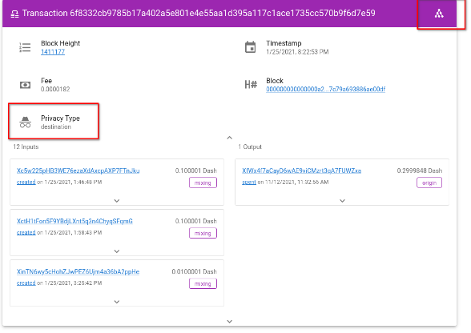
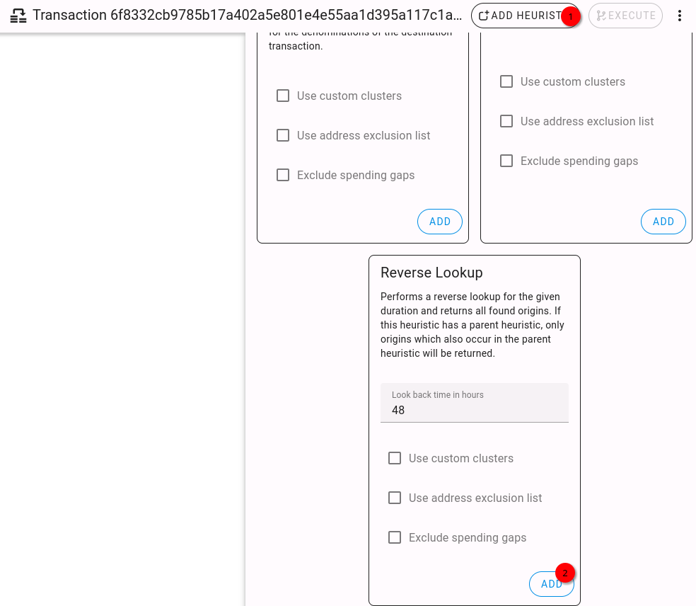
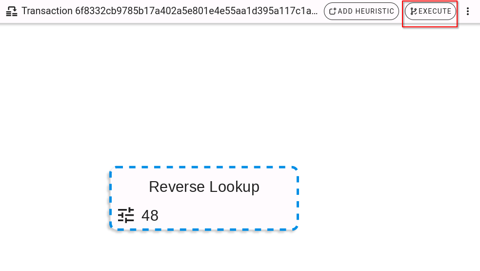
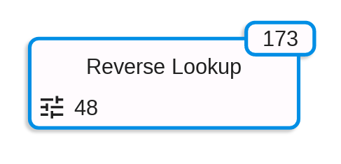
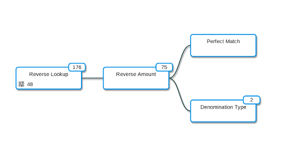
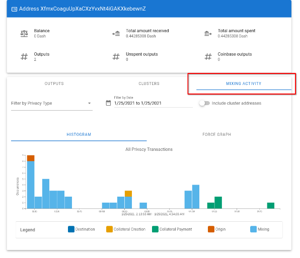

# Usage Example

## CoinJoin analysis

To start with a CoinJoin analysis, a transaction which spends mixed funds
(we call this a [destination transaction](transactionTypes/destinationTransaction.md)) is needed. Transaction
``6f8332cb9785b17a402a5e801e4e55aa1d395a117c1ace1735cc570b9f6d7e59`` is of that transaction type.
After searching for the transaction, via the search bar, the transaction details are shown (see screenshot below).
Via a button on the top right of the transaction details page, the heuristic editor can be opened, which allows
creating and executing heuristics to filter the set of possible origin points of a CoinJoin.

New heuristics can be added in the heuristic editor via the button ``Add Heuristic``.
The heuristics are organised by their search direction, either forward (traversing the transaction graph
forward in time) or backward (traversing the transaction graph backwards in time).

For this example click the ``Reverse`` tab and choose one of the heuristics, for example the ``Reverse Lookup`` (see screenshot below).

After that, the chosen heuristic will appear in heuristic editor. Choose ``Execute`` to start the heuristic.
After a while the heuristic will be finished, and you can view your results.

In this case the heuristic returned 176 address clusters which could be the source of the transaction
(addresses are clustered via [multi-input address clustering](addressCluster.md)).

Further details can be viewed by clicking on the heuristic.

Heuristics can also be combined by dragging and dropping them on each other.
This way several heuristic methods can be applied in sequence.

## Mixing Activity

The mixing activity of an address or cluster can be displayed on the address page.
This shows which [privacy transactions](transactionTypes/privacyTransactions.md)
are directly connected to an address. This is useful for detecting if an address or cluster
has been part of a CoinJoin process.

Example for address ``XyUyturx3xTEMGK7FtZcbhbfbzFSQiUQng``:

